# 🏭 Clothes Factory Management System


A full-stack web application to digitally manage daily operations in a clothes manufacturing factory — including workers, customer orders, and production stages.

---

## 📋 Table of Contents

- [Project Overview](#-project-overview)
- [Features](#-features)
- [Technologies Used](#-technologies-used)
- [Project Structure](#-project-structure)
- [Setup & Installation](#-setup--installation)
- [API Endpoints](#-api-endpoints)
- [Screenshots](#-screenshots)
- [Testing](#-testing)
- [Conclusion](#-conclusion)

---

## 📌 Project Overview

Many small and medium clothes factories still rely on manual methods — notebooks, spreadsheets — to manage workers, orders, and production progress. This leads to:

- Lost or misplaced records
- Difficulty tracking production stages
- Slow data updates and human errors

This system solves these problems by providing a **digital management platform** with a clean UI and a RESTful backend API.

---

## ✨ Features

### 👷 Worker Management
- Add new workers
- View all workers
- Update worker details
- Delete workers

### 📦 Order Management
- Add customer orders
- View all orders
- Update order status
- Delete orders

### 🏗️ Production Management
- Add production stages
- View production progress
- Update production details
- Delete production records

---

## 🛠️ Technologies Used

### Backend
| Technology | Purpose |
|---|---|
| Node.js | Server runtime |
| Express.js | REST API framework |
| MongoDB | Database |
| Mongoose | ODM for MongoDB |
| dotenv | Environment variables |
| cors | Cross-origin requests |

### Frontend
| Technology | Purpose |
|---|---|
| React.js | UI framework |
| Axios | HTTP client |
| React Router DOM | Page navigation |
| CSS | Styling |

### Tools
| Tool | Purpose |
|---|---|
| Postman | API testing |
| GitHub | Version control |

---

## 📁 Project Structure

```
Clothes_Factory_Management_System/
│
├── models/               # Mongoose schemas
├── controllers/          # Route handler logic
├── routes/               # API route definitions
├── server.js             # Entry point
├── .env                  # Environment variables
├── package.json
│
└── frontend/
    ├── src/
    │   ├── pages/        # Dashboard, Workers, Orders, Production
    │   ├── components/   # Reusable UI components
    │   └── App.js
    └── public/
```

---

## ⚙️ Setup & Installation

### Prerequisites
- Node.js installed
- MongoDB running locally or a MongoDB Atlas connection string

---

### Step 1 — Clone the Repository

```bash
git clone https://github.com/Kaushi2002Nishu/Clothes_Factory_Management_System.git
cd Clothes_Factory_Management_System
```

---

### Step 2 — Install Backend Dependencies

```bash
npm install
```

---

### Step 3 — Configure Environment Variables

Create a `.env` file in the root directory:

```env
MONGO_URI=mongodb://127.0.0.1:27017/factory
PORT=5000
```

---

### Step 4 — Start the Backend Server

```bash
npx nodemon server.js
```

Expected output:

```
MongoDB Connected
Server running on port 5000
```

---

### Step 5 — Start the Frontend

```bash
cd frontend
npm install
npm start
```

The app will open at: **http://localhost:3000**

---

## 📡 API Endpoints

### 👷 Workers API

| Method | Endpoint | Description |
|---|---|---|
| `POST` | `/api/workers` | Add a new worker |
| `GET` | `/api/workers` | Get all workers |
| `PUT` | `/api/workers/:id` | Update a worker |
| `DELETE` | `/api/workers/:id` | Delete a worker |

**Example — Create Worker:**
```json
POST /api/workers
{
  "name": "Nimal",
  "position": "Tailor"
}
```

---

### 📦 Orders API

| Method | Endpoint | Description |
|---|---|---|
| `POST` | `/api/orders` | Add a new order |
| `GET` | `/api/orders` | Get all orders |
| `PUT` | `/api/orders/:id` | Update an order |
| `DELETE` | `/api/orders/:id` | Delete an order |

**Example — Create Order:**
```json
POST /api/orders
{
  "customerName": "Kasun",
  "productType": "Shirt",
  "quantity": 10
}
```

---

### 🏗️ Production API

| Method | Endpoint | Description |
|---|---|---|
| `POST` | `/api/productions` | Add a production record |
| `GET` | `/api/productions` | Get all production records |
| `DELETE` | `/api/productions/:id` | Delete a production record |

**Example — Create Production Record:**
```json
POST /api/productions
{
  "stage": "Cutting"
}
```

---

## 📸 Screenshots

### 🖥️ Frontend — Dashboard

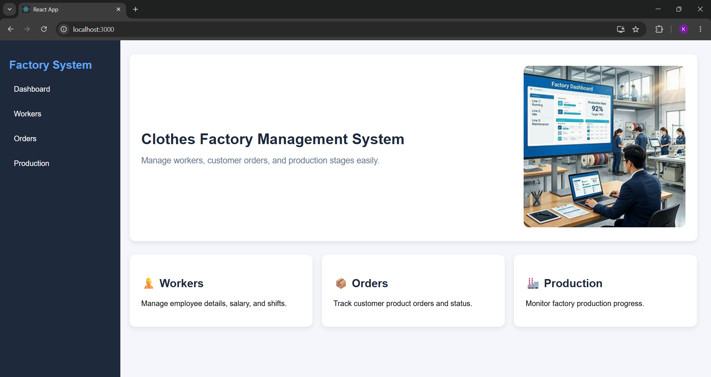

---

### 👷 Frontend — Workers Page

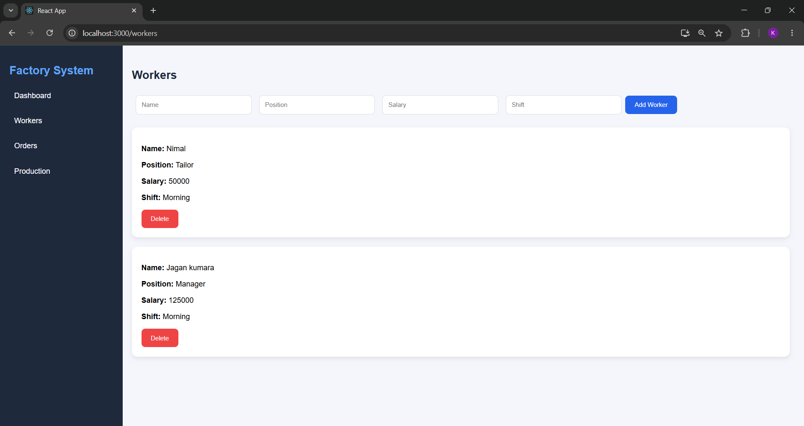

---

### 📦 Frontend — Orders Page

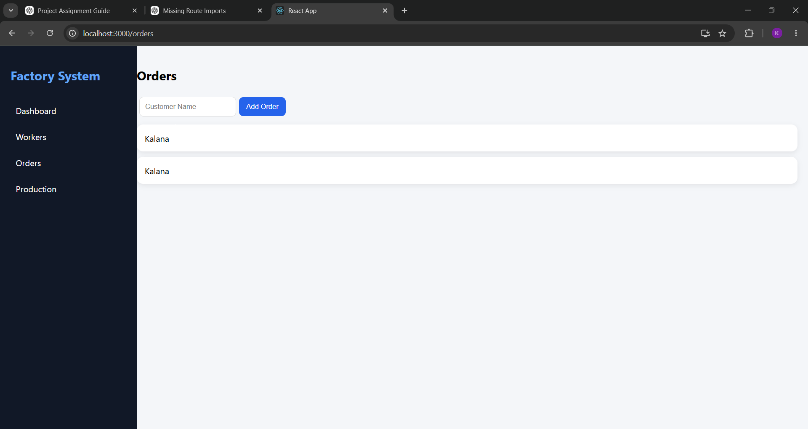

---

### 🏗️ Frontend — Production Page

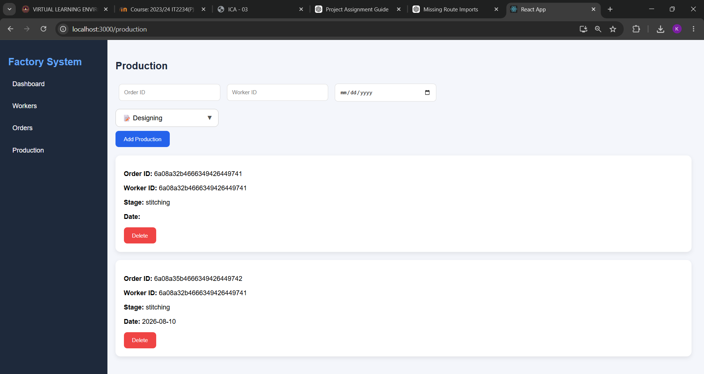

---

### 🧪 Postman — Add Worker (POST)

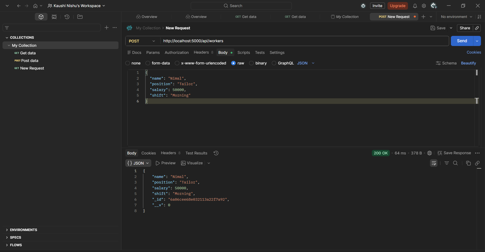

---

### 🧪 Postman — Display Workers (GET)

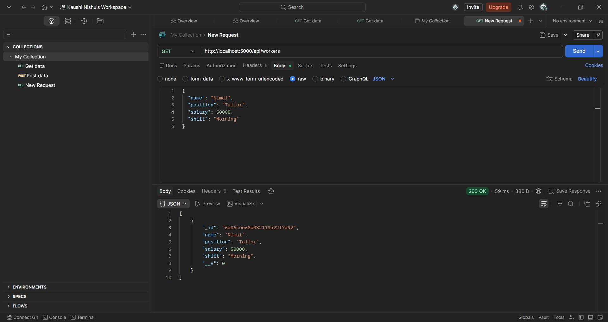

---

### 🧪 Postman — Update Worker (PUT)

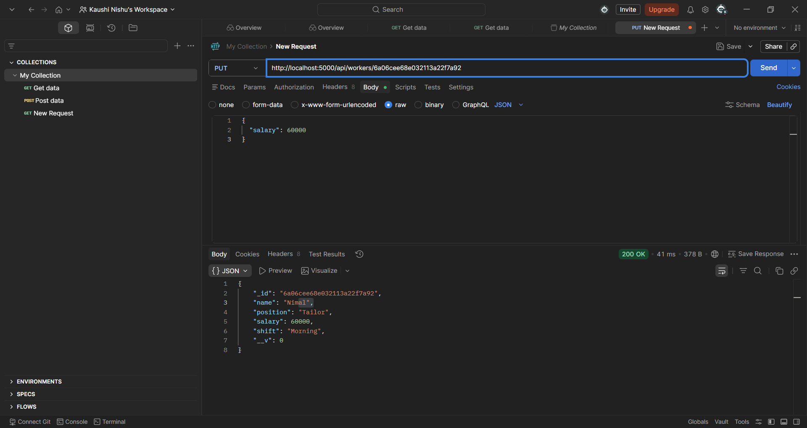

---

### 🧪 Postman — Add Order (POST)

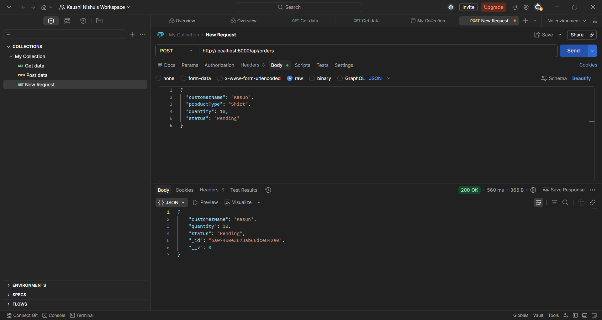

---

### 🧪 Postman — Get Order (PUT)


---

### 🧪 Postman — Delete Order (DELETE)

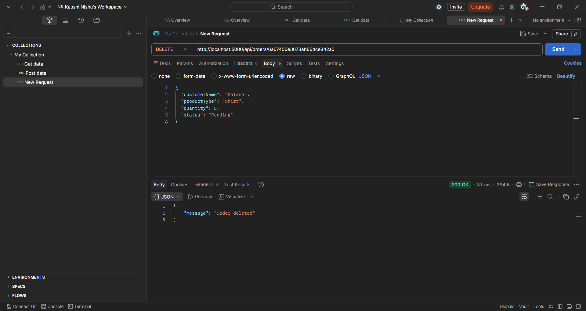

---

### 🧪 Postman — Add Production (POST)

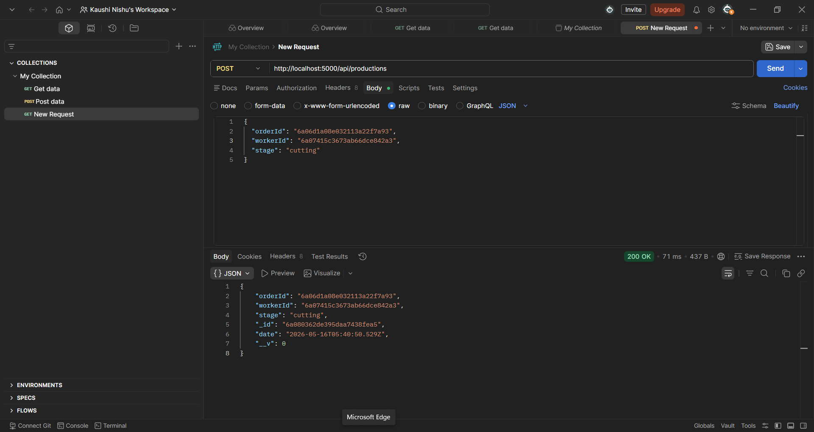

---

### 🧪 Postman — Display Production (GET)

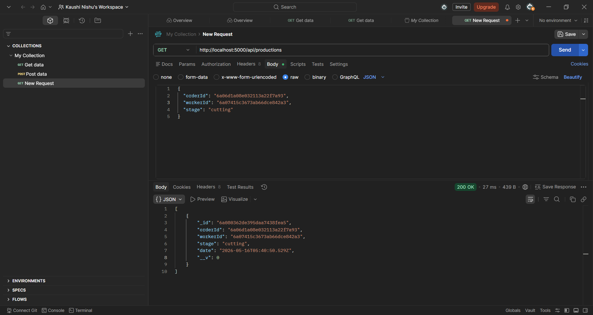

---

### 🧪 Postman — Delete Production (DELETE)

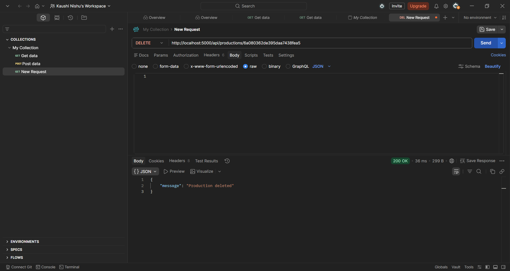

---
### 🗄 MongoDB Database Collections
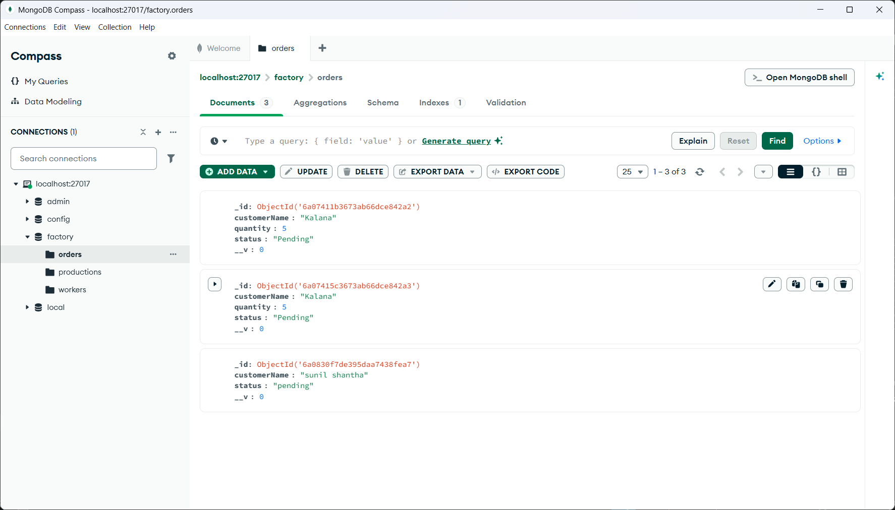

---
## ✅ Testing

All CRUD operations were tested using:
- **Postman** — for direct API endpoint testing
- **Frontend UI** — for end-to-end user flow testing

All endpoints returned correct responses with appropriate HTTP status codes.

---

## 🏁 Conclusion

The **Clothes Factory Management System** provides a complete digital solution for small and medium-sized garment factories. It improves:

- ✅ Operational efficiency
- ✅ Data accuracy
- ✅ Record organisation
- ✅ Production monitoring

This project demonstrates practical skills in **REST API development**, **full-stack web development**, **database integration**, and **API testing**.

---

## 👨‍💻 Author

**Your Name**  
GitHub: [@Kaushi2002Nishu](https://github.com/Kaushi2002Nishu)

---

## 📄 License

This project is licensed under the [MIT License](LICENSE).
